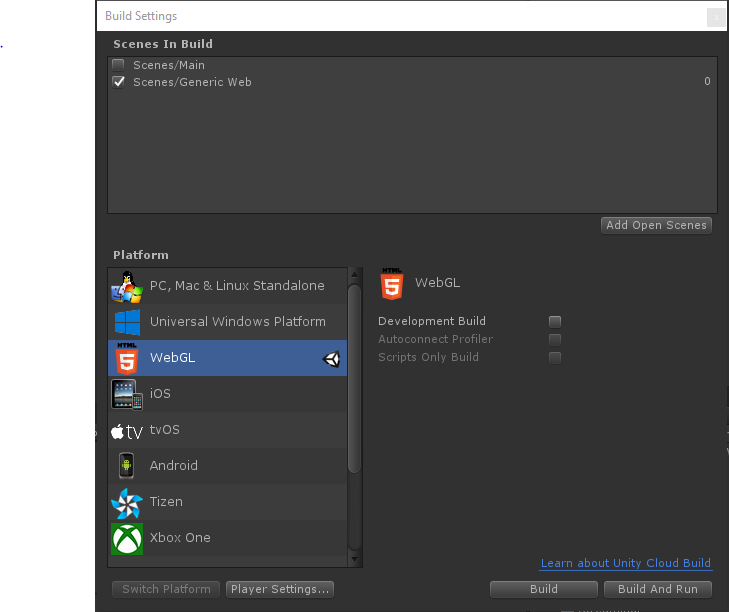

# Unity3DTiles

Unity3DTiles is a Unity based implementation of the [3DTiles](https://github.com/AnalyticalGraphicsInc/3d-tiles) open format for streaming and rendering large static models such as those generated by photogrammetry pipelines.  The benefit of the 3D Tiles specification is that it allows one generic rendering implementation to support datasets tiled using a number of different data structures such as binary, quad, or oct trees.  It also supports sparse data representations so it can adapt well to datasets with variable detail density.  

### Implementation Details

Reference information about the object model and tree traversal algorithm can be found [here](Docs\AlgorithmReference.md).

##### Supported Features

Please note that since initial development completed, the 3d-tiles specification has evolved.  The tileset.json schema use is now modestly out of date and should be updated in the near future.

**Tile Format Support**

- [x] Batched b3dm 
- [ ] Instanced i3dm 
- [ ] Point Cloud pnts - Implemented but untested
- [ ] Composite cmt

**Tileset Feature Support**

- [ ] Bounding Volumes
  - [x] Sphere
  - [x] Box
  - [ ] Region
- [ ] viewerRequestVolume
- [x] Geometric Error - possible minor bugs in calculation
- [x] Tile.Content
- [ ] Transforms - Basic support but does not handle parent/child transforms or runtime changes
- [ ] Add Refinement
- [x] Replace Refinement
- [x] Frustum culling
- [x] Tree traversal
- [ ] Recursive tilesets

### Dependencies

* Unity3DTiles depends on the [C-Sharp-Promise Library](https://www.nuget.org/packages/RSG.Promise/) whose DLL has been imbedded in the plugins directory of this project.
* This project utilizes an automatically generated schema to parse the 3D Tiles format.  Instructions for updating this schema can be found [here](Docs/3DTileSchemaUpdate.md).
* This project also depends on [UnityGLTF](https://github.com/KhronosGroup/UnityGLTF).  To simplify usage and avoid compilation issues for different platforms, a version of the UnityGLTF package has been checked into the `Assets/UnityGLTF` folder so that users do not need to build it independently.  Some minor modifications to the UnityGLTF package were necessary.  The modifications as well as the procedure for updating the package can be found [here](Docs/UnityGLTFImport.md).
* The Newtonsoft package from the Untiy Asset Store has been installed to support efficient deserialization of json.

### Usage

This project contains several sample scenes.  

* `MainWeb` - Loads a sample tileset with settings tuned for web
* `MainHololens` - Similar to MainWeb but tuned for HoloLens.  Contains a few HoloLens specific configuration scripts
* `GenericWeb` - Builds a generic web package that can ingest tilesets dynamically from URL parameters
* `SampleModelLoader` - Used to test loading different tile formats such as GLTF, GLTB, and B3DM

To import into your own project, simply copy the following folders

* Unity3DTiles
* UnityGLTF
* JsonDotNet
* Plugins
* Resources

###### Configuration

To get started, simply add a TilesetBehaviour to an empty game object.  You can configure the TilesetBehaviour renderer using the SceneOptions and TilesetOptions objects.  The Url parameter is typically an HTTP url but in the examples we have added a script to convert a StreamingAsset relative path to a full path at runtime so that the example assets can be included along with the code.

Scene options: 

* Maximum Tiles To Process Per Frame - Loading large numbers of tiles per frame can decrease load times but introduce choppy performance (especially on the web) when many tiles are being loaded at once.
* LRU Cache Target Size - Controls the total number of tiles that will be kept in memory at any given time.  The cache can exceed this size if more tiles are need to render the current viewpoint.  Setting this too low will mean tiles are constantly re-requested and impact performance when changing views.  Setting this too high will result in more memory being used which can cause crashes on platforms such as the web or hololens.
* LRU Cache Max Size - Sets the target maximum number of tiles that can be loaded into memory at any given time.  Beyond this limit, unused tiles will be unloaded as new requests are made.
* LRU Max Frame Unload Ratio - Controls the number of tiles that will be unloaded per frame when the cache becomes too full.  Setting too high can cause choppy performance.  Setting too low will slow the loading of new tiles as they will wait for old tiles to be unloaded.
*  Max Concurrent Requests - Manages how many downloads can occurs simultaneously.  Larger results in faster load times but this should be tuned for the particular platform you are deploying to.
* Clipping cameras - the set of cameras that should be used to determine which tiles to load.  Typically this will just be the main camera.  Adding more cameras will decrease performance.
  * GLTF Shader Override - Overrides shader override of individual tilesets.

Tileset options:

* Name - Name of the tileset, must be unique when loading multiple tilesets.  Defaults to Url if null or empty.
* Url - The http address of the tileset json file you want to load.  Tiles for this tileset should typically be located in the same folder as the json file
* Show - Initially Disable / Enable rendering of tiles for this tileset.  Does not disable loading or frustum culling.
* Maximum Screen Space Error - Controls how much detail is rendered.  Lower SSE results in more detail
* Skip Screen Space Error Multiplier - Used to avoid loading high level (low resolution) tiles.  Increasing this results in more high level tiles being skipped when loading
* Load siblings - If a tile is in view and needs to be rendered, also load its siblings even if they are not visible.  Especially useful when using colliders so that raycasts outside the users field of view can succeed.  Increases load time and number of tiles that need to be stored in memory.
* Max Depth - can be used to limit how far down the tree tiles are rendered.  Most useful for debugging.
* GLTF loader settings
  * GLTF Multithreaded Load - can increase performance but can also crash on some platforms that don't support multiple threads
  * GLTF maximum LOD - typically default is fine unless the tiles themselves specify LOD information
  * GLTF Shader Override - If set to null UnityGLTF will use the `StandardShader` for GLTF assets.  This can have dramatic performance impacts on HoloLens.  This allows a different shader to be used when instantiation  GLTF assets.  Also see `Unity3DTilesetStyle` which provides a flexible way to change style properties such as shaders at runtime on a tile by tile basis.
* Debug Settings
  * Debug Draw Bounds - Draw tile bounds.  Very slow

### The Generic Web Scene

A generic web build configuration is available which reads the tileset to load at runtime based on a URL parameter. Options may also be overridden by URL parameters.

##### Building 

Configure the Unity build for the WebGL platform and enable only the "GenericWeb" scene 

Click Build (or Build and Run if you want to test locally), and select the folder `Unity3DTilesWeb` for output.

##### Usage

The generic web build recognizes the following URL parameters:

* SceneOptions - URL to JSON file overriding any subset of Unity3DTilesetSceneOptions.
* Scene - URL to JSON file containing scene to load (see `SceneManifest.cs`).
* Tileset - URL to single tileset to load.
* TilesetOptions - URL to JSON overriding any subset of single tileset Unity3DTilesetOptions.

Tileset and TilesetOptions are ignored if Scene is specified.

When running in the Unity editor use the SceneOptions and SceneUrl inspectors instead of the SceneOptions and Scene
URL parameters.  Also, any tilesets pre-populated in the TilesetOptions list inspector will be loaded at start.

URLs starting with "data://" will be loaded from the Unity StreamingAssets folder.

Example: `http://uri.to/generic/web/deployment/index.html?Tileset=http%3A%2F%2Furi.to%2Ftileset.json&TilesetOptions=http%3A%2F%2Furi.to%2Foptions.json&MaxConcurrentRequests=100`
